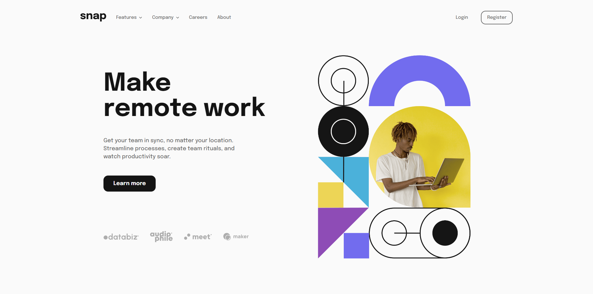

# Frontend Mentor - Intro section with dropdown navigation solution

This is a solution to the [Intro section with dropdown navigation challenge on Frontend Mentor](https://www.frontendmentor.io/challenges/intro-section-with-dropdown-navigation-ryaPetHE5). Frontend Mentor challenges help you improve your coding skills by building realistic projects. 

## Table of contents

- [Overview](#overview)
  - [The challenge](#the-challenge)
  - [Screenshot](#screenshot)
  - [Links](#links)
- [My process](#my-process)
  - [Built with](#built-with)
  - [What I learned](#what-i-learned)
- [Author](#author)

**Note: Delete this note and update the table of contents based on what sections you keep.**

## Overview

### The challenge

Users should be able to:

- View the relevant dropdown menus on desktop and mobile when interacting with the navigation links
- View the optimal layout for the content depending on their device's screen size
- See hover states for all interactive elements on the page

### Screenshot



### Links

- Live Site URL: [https://mivanrais.github.io/Intro-section-with-dropdown-navigation/](https://mivanrais.github.io/Intro-section-with-dropdown-navigation/)

## My process

### Built with

- Semantic HTML5 markup
- CSS custom properties
- Flexbox
- Desktop-first workflow

### What I learned

There are three pieces of knowledge that I've got since I took the challenge.

1. Change a color's svg element

I learned how to change color's a svg element, this is how I can change the color's svg element:   

```html
<svg width="10" height="6" xmlns="http://www.w3.org/2000/svg">
  <path stroke="#686868" stroke-width="1.5" fill="none" d="m1 1 4 4 4-4" />
</svg>
```
```css
.activePath {
    stroke: var(--black);
}
```
```js
const links = document.querySelectorAll('.with-icon');
const svgs = document.querySelectorAll('.with-icon>svg>path');
const topLevelEntryContainers = document.querySelectorAll('.top-level-entry-container');

links[0].addEventListener('click', (e) => {
    topLevelEntryContainers[0].classList.toggle('show-sub-menu');
    if (!links[0].classList.contains('activeSvg')) {
        links[0].classList.add('activeSvg');
        links[0].classList.add('activeLink');
        svgs[0].classList.add('activePath');
    }
    else if (links[0].classList.contains('activeSvg')) {
        links[0].classList.remove('activeSvg');
        links[0].classList.remove('activeLink');
        svgs[0].classList.remove('activePath');

        links[0].classList.add('inactiveSvg');

        setTimeout(() => {
            links[0].classList.remove('inactiveSvg');
        }, 500);
    }
})
```

<br>

2. Create a sub menu

I learned how to create interactive sub menus which is when I click a link that contains sub menu, The sub menu corresponding to the link will appear. This is a snippet how I create them.  

```html
 <ul>
          <li>
            <a href="#" class="with-icon">
              Features
              <svg width="10" height="6" xmlns="http://www.w3.org/2000/svg">
                <path stroke="#686868" stroke-width="1.5" fill="none" d="m1 1 4 4 4-4" />
              </svg>
            </a>
            <ul class="top-level-entry-container" id="sub-menu-features">
              <li>
                <a href="#">
                  
                  Todo List
                </a>
              </li>
              <li>
                <a href="#">
                  
                  Calendar
                </a>
              </li>
              <li>
                <a href="#">
                  
                  Reminders
                </a>
              </li>
              <li>
                <a href="#">
                  
                  Planing
                </a>
              </li>
            </ul>
          </li>
          <li>
            <a href="#" class="with-icon">
              Company
              <svg width="10" height="6" xmlns="http://www.w3.org/2000/svg">
                <path stroke="#686868" stroke-width="1.5" fill="none" d="m1 1 4 4 4-4" />
              </svg>
            </a>
            <ul class="top-level-entry-container">
              <li><a href="#">History</a></li>
              <li><a href="#">Our Team</a></li>
              <li><a href="#">Blog</a></li>
            </ul>
          </li>
          <li><a href="#">Careers</a></li>
          <li><a href="#">About</a></li>
        </ul>
```

```css
.top-level-entry-container {
    margin: var(--spacing-md) 0 0 0;
    flex-direction: column;
    position: absolute;
    width: max-content;
    align-items: flex-start;
    background-color: var(--bg-white);
    box-shadow: 0px 2px 15px -4px var(--bg-gray);
    padding: calc(var(--spacing-md) + 4px);
    border-radius: var(--sub-menu-container);
    -webkit-border-radius: var(--sub-menu-container);
    -moz-border-radius: var(--sub-menu-container);
    -ms-border-radius: var(--sub-menu-container);
    -o-border-radius: var(--sub-menu-container);
    opacity: 0;
    transform: scaleY(0.9);
    -webkit-transform: scaleY(0.9);
    -moz-transform: scaleY(0.9);
    -ms-transform: scaleY(0.9);
    -o-transform: scaleY(0.9);
    transform-origin: center top;
    transition: 0.1s all ease;
    -webkit-transition: 0.1s all ease;
    -moz-transition: 0.1s all ease;
    -ms-transition: 0.1s all ease;
    -o-transition: 0.1s all ease;
}

.top-level-entry-container>li {
    margin: 0 0 var(--spacing-md) 0;
}

.top-level-entry-container>li:last-child {
    margin: 0;
}

.top-level-entry-container img {
    width: 15px;
    margin: 0 var(--spacing-sm) 0 0;
}

#sub-menu-features {
    left: -70px;
}

.show-sub-menu {
    opacity: 1;
    transform: scaleY(1);
    -webkit-transform: scaleY(1);
    -moz-transform: scaleY(1);
    -ms-transform: scaleY(1);
    -o-transform: scaleY(1);
    transform-origin: center top;
    transition: 0.1s all ease;
    -webkit-transition: 0.1s all ease;
    -moz-transition: 0.1s all ease;
    -ms-transition: 0.1s all ease;
    -o-transition: 0.1s all ease;
}
```

```js
const links = document.querySelectorAll('.with-icon');
const svgs = document.querySelectorAll('.with-icon>svg>path');
const topLevelEntryContainers = document.querySelectorAll('.top-level-entry-container');

links[0].addEventListener('click', (e) => {
    topLevelEntryContainers[0].classList.toggle('show-sub-menu');
    if (!links[0].classList.contains('activeSvg')) {
        links[0].classList.add('activeSvg');
        links[0].classList.add('activeLink');
        svgs[0].classList.add('activePath');
    }
    else if (links[0].classList.contains('activeSvg')) {
        links[0].classList.remove('activeSvg');
        links[0].classList.remove('activeLink');
        svgs[0].classList.remove('activePath');

        links[0].classList.add('inactiveSvg');

        setTimeout(() => {
            links[0].classList.remove('inactiveSvg');
        }, 500);
    }
})
```

<br>

3. Create The Interactive Side Navigation for Small Devices

The last thing that I learned was creating a nav side for small devices. This is a snippet how I created it. 

```HTML
 <nav>
      
      <ul>
        <li>
          <a href="#" class="with-icon">
            Features
            <svg width="10" height="6" xmlns="http://www.w3.org/2000/svg">
              <path stroke="#686868" stroke-width="1.5" fill="none" d="m1 1 4 4 4-4" />
            </svg>
          </a>
          <ul class="sub-menu">
            <li>
              <a href="#">
                
                Todo List
              </a>
            </li>
            <li>
              <a href="#">
                
                Calendar
              </a>
            </li>
            <li>
              <a href="#">
                
                Reminders
              </a>
            </li>
            <li>
              <a href="#">
                
                Planning
              </a>
            </li>
          </ul>
        </li>
        <li>
          <a href="#" class="with-icon">
            Company
            <svg width="10" height="6" xmlns="http://www.w3.org/2000/svg">
              <path stroke="#686868" stroke-width="1.5" fill="none" d="m1 1 4 4 4-4" />
            </svg>
          </a>
          <ul class="sub-menu">
            <li>
              <a href="#">
                Todo List
              </a>
            </li>
            <li>
              <a href="#">
                Calendar
              </a>
            </li>
            <li>
              <a href="#">
                Reminders
              </a>
            </li>
          </ul>
        </li>
        <li><a href="#">Careers</a></li>
        <li><a href="#">About</a></li>
      </ul>
      <div class="btn-group">
        <button class="btn-secondary">Login</button>
        <button class="btn-secondary with-border">Register</button>
      </div>
    </nav>
```

```CSS
main nav {
    box-sizing: border-box;
    transform: translateX(500px);
    display: flex;
    flex-direction: column;
    align-items: flex-start;
    -webkit-transform: translateX(500px);
    -moz-transform: translateX(500px);
    -ms-transform: translateX(500px);
    -o-transform: translateX(500px);
    background-color: var(--bg-white);
    height: 100vh;
    width: 200px;
    padding: var(--spacing-md) var(--spacing-md);
    position: fixed;
    top: 0;
    right: 0;
    z-index: 1;
}

.nav-side {
    transform: translateX(0);
    -webkit-transform: translateX(0);
    -moz-transform: translateX(0);
    -ms-transform: translateX(0);
    -o-transform: translateX(0);
    transition: 0.1s all ease;
    -webkit-transition: 0.1s all ease;
    -moz-transition: 0.1s all ease;
    -ms-transition: 0.1s all ease;
    -o-transition: 0.1s all ease;
}

main nav::before {
    content: "";
    width: 150%;
    height: 100vh;
    background-color: hsl(0, 0%, 8%, 0.8);
    position: absolute;
    left: 0;
    top: 0;
    transform: translateX(-300px);
    -webkit-transform: translateX(-300px);
    -moz-transform: translateX(-300px);
    -ms-transform: translateX(-300px);
    -o-transform: translateX(-300px);
}

#btn-close {
    margin: 0 0 var(--spacing-md) 0;
    width: 22px;
    align-self: flex-end;
}

#btn-close:hover {
    cursor: pointer;
}

main nav ul {
    margin: 0 0 var(--spacing-md) 0;
    flex-direction: column;
    align-items: flex-start;
    justify-content: flex-start;
}

main nav ul li {
    margin: 0 0 calc(var(--spacing-md) + 5px) 0;
}

main nav .btn-group,
main nav .btn-group button {
    width: 100%;
}

main nav .btn-group button:first-child {
    margin: 0 0 var(--spacing-md) 0;
    padding: 0;
}

main nav .sub-menu {
    display: none;
    margin: calc(var(--spacing-md) + 5px) 0 0 var(--spacing-md);
}

main nav .show-sub-menu-side {
    display: flex;
}

main nav .sub-menu>li:last-child {
    margin: 0;
}

main nav .sub-menu img {
    width: 15px;
    margin: 0 var(--spacing-sm) 0 0;
}
```

```JavaScript
const burgerMenu = document.querySelector('#burger-menu');
const navSide = document.querySelector('main>nav');
const btnClose = document.querySelector('#btn-close');
const body = document.querySelector('body');
const subMenusSide = document.querySelectorAll('.sub-menu');

burgerMenu.addEventListener('click', () => {
    navSide.classList.add('nav-side');
    body.style.overflowY = 'hidden';
})

btnClose.addEventListener('click', () => {
    navSide.classList.remove('nav-side');
    body.style.overflowY = 'visible';
})

links[2].addEventListener('click', () => {
    subMenusSide[0].classList.toggle('show-sub-menu-side');
    if (!links[2].classList.contains('activeSvg')) {
        links[2].classList.add('activeSvg');
        links[2].classList.add('activeLink');
        svgs[2].classList.add('activePath');
    }
    else if (links[2].classList.contains('activeSvg')) {
        links[2].classList.remove('activeSvg');
        links[2].classList.remove('activeLink');
        svgs[2].classList.remove('activePath');

        links[2].classList.add('inactiveSvg');

        setTimeout(() => {
            links[2].classList.remove('inactiveSvg');
        }, 500);
    }
})

links[3].addEventListener('click', () => {
    subMenusSide[1].classList.toggle('show-sub-menu-side');
    if (!links[3].classList.contains('activeSvg')) {
        links[3].classList.add('activeSvg');
        links[3].classList.add('activeLink');
        svgs[3].classList.add('activePath');
    }
    else if (links[3].classList.contains('activeSvg')) {
        links[3].classList.remove('activeSvg');
        links[3].classList.remove('activeLink');
        svgs[3].classList.remove('activePath');

        links[3].classList.add('inactiveSvg');

        setTimeout(() => {
            links[3].classList.remove('inactiveSvg');
        }, 500);
    }
})
```

## Author

- Frontend Mentor - [@MIvanRais](https://www.frontendmentor.io/profile/MIvanRais)